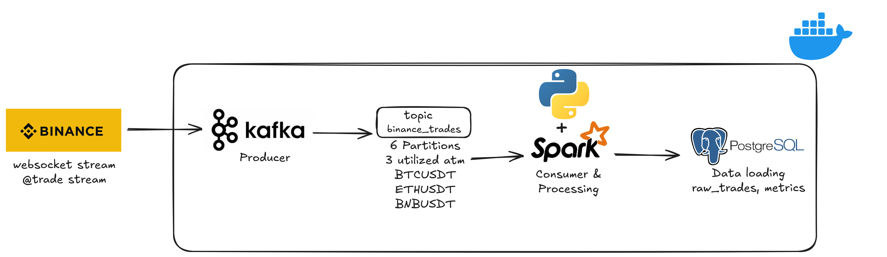

# Real time Crypto Trade ETL pipeline

The project is a real-time data pipeline that accepts streaming data from binance using its [Websocket Streams](https://github.com/binance/binance-spot-api-docs/blob/master/web-socket-streams.md) and streams the `@trade` stream. 
we combine the streams and access `BTCUSDT`, `ETHUSDT`, and `BNBUSDT` symbols. 

The entire pipeline is dockerized. 

The data is stored in postgres
1. `raw_trades` -> stores raw json from binance and additional timestamps.
2. `metrics` -> stores processed windowed metrics. 

---

The flow is as follows



---
### Tech used

- Python 3.12
- Apache Kafka (Kraft)
- Apache Spark
- Postgres
- Kafdrop
- Docker and Docker Compose
- [***uv***](https://github.com/astral-sh/uv) (for python environment management)

```
Folder
│   .gitignore
│   .python-version
│   compare.py
│   main.py
│   pyproject.toml
│   README.md
│   uv.lock
│
├───docker
│   │   docker-compose.yml
│   │
│   └───scripts
│           create-topics.sh
│
├───ingestion
│       producer.py
│       websocket_client.py
│
├───postgres
│       create_metrics.sql
│       create_raw_trades.sql
│
└───spark
        spark_streaming.py
```

## How to run

### Prerequisites
Ensure you have Python 3.12 \
Docker and Docker Compose \
[uv](https://github.com/astral-sh/uv)

### Setup python environment.
From the project root folder \
`uv sync` \
this will create the virtual environments and install dependencies form `pyproject.toml` \
activate the environment by running in root\
`.venv\Scripts\activate` \
and deactivate by \
`.venv\Scripts\deactivate` 

usually simply creating a new terminal in vs code automatically activates the venv (ctrl + shift + `) to start a new terminal

---
### docker and producer.py

make sure you are in root folder \
`cd docker` -> `docker compose up -d`

the `docker/scripts/create-topics.sh` bash file runs by itself after 10 seconds to ensure all the kafka and docker instances are running fully.

run `producer.py` after 10 seconds once running `docker compose kafka-init logs` shows `Topic setup complete.`

when in root folder, run \
`cd ingestion` \
`uv run python producer.py`

---
the tables are auto-created using JDBC (java database connectivity) in the spark_streaming.py file.

to verify the data in postgres, run \
`docker exec -it postgres psql -U spark -d crypto` 

`SELECT * FROM raw_trades ORDER BY trade_time DESC LIMIT 5;` to check the raw_trades table 

`SELECT * FROM metrics ORDER BY window_start DESC LIMIT 5;` to check the metrics table

---

this is just the basic pipeline. 
stuff thats still left to do includes 
- some visualization (grafana possibly)
-  maybe some ml
- db table creation in a way that jdbc isnt used to ensure  
- refine it, figure out the kinks, maybe add checkpoints. i might make it an etl pipeline analytics... like getting the analytics of the pipeline itself? idk
- maybe increase the number of producers to include kline or tickers or aggtrade. 

---

The main idea of this project was to **learn**. I wanted to understand how `kafka` works, how `pyspark` works. 

This is just a basic pipeline. it does not handle errors as of now, i will be working on it. i believe it still has some errors.

---